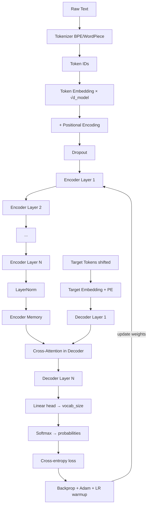

# Architecture Diagrams

ASCII and text diagrams for every major Transformer component.

---

## 1. Full Original Transformer (Encoder + Decoder)

```
┌────────────────────────────────────────────────────────────────────┐
│                    FULL TRANSFORMER                                │
│                 (Vaswani et al., 2017)                             │
├─────────────────────────┬──────────────────────────────────────────┤
│       ENCODER           │            DECODER                       │
│                         │                                          │
│  Input (source)         │  Output (target, shifted right)          │
│       │                 │       │                                  │
│  [Embedding + PE]       │  [Embedding + PE]                        │
│       │                 │       │                                  │
│  ┌────▼────────────┐    │  ┌────▼──────────────────────────────┐  │
│  │ Multi-Head      │    │  │ Masked Multi-Head Self-Attention   │  │
│  │ Self-Attention  │    │  │ (causal mask — can't see future)   │  │
│  └────┬────────────┘    │  └────┬──────────────────────────────┘  │
│       │                 │       │                                  │
│  [Add & Norm]           │  [Add & Norm]                           │
│       │                 │       │                                  │
│  ┌────▼────────────┐    │  ┌────▼──────────────────────────────┐  │
│  │ Feed-Forward    │    │  │ Cross-Attention                    │  │
│  │ Network         │    │  │ Q=decoder, K=V=encoder memory      │  │
│  └────┬────────────┘    │  └────┬──────────────────────────────┘  │
│       │                 │       │                                  │
│  [Add & Norm]           │  [Add & Norm]                           │
│       │                 │       │                                  │
│  × N layers             │  ┌────▼──────────────────────────────┐  │
│       │                 │  │ Feed-Forward Network               │  │
│       │                 │  └────┬──────────────────────────────┘  │
│       │                 │       │                                  │
│       │                 │  [Add & Norm]                           │
│       │                 │       │                                  │
│       │                 │  × N layers                             │
│       │                 │       │                                  │
│       ├─────────────────►  [Linear → Vocab Size]                  │
│  encoder memory         │       │                                  │
│                         │  [Softmax]                              │
│                         │       │                                  │
│                         │  Output probabilities                    │
└─────────────────────────┴──────────────────────────────────────────┘
```

---

## 2. Scaled Dot-Product Attention

```
         Q          K          V
         │          │          │
         ▼          ▼          │
       MatMul ◄────►          │
         │                    │
         ▼                    │
    Scale (÷√d_k)             │
         │                    │
         ▼                    │
      [Mask]  (optional)      │
         │                    │
         ▼                    │
      SoftMax                 │
         │                    │
         ▼                    ▼
            MatMul ◄─────────►
                │
                ▼
             Output
         (B, seq_q, d_v)
```

---

## 3. Multi-Head Attention

```
         Q         K         V
         │         │         │
    ┌────▼─────────▼─────────▼────┐
    │   Linear  Linear  Linear    │  ← W^Q, W^K, W^V (d_model × d_model each)
    └────┬─────────┬─────────┬────┘
         │         │         │
    Split into h heads (8 heads, d_k=64 each)
         │         │         │
    ┌────▼─────────▼─────────▼────┐
    │  ScaledDotProductAttention  │  ← runs in parallel for all h heads
    │   head_i = Attn(Q_i,K_i,V_i)│
    └─────────────┬───────────────┘
                  │
              Concat heads
                  │
                  ▼
            ┌─────────┐
            │ Linear  │  ← W^O (d_model × d_model)
            └────┬────┘
                 │
                 ▼
               Output
           (B, seq, d_model)
```

---

## 4. Encoder Layer (one of N=6)

```
Input x  (B, seq, d_model)
   │
   ├─────────────────────────────────┐  (residual)
   │                                 │
   ▼                                 │
Multi-Head Self-Attention            │
   │                                 │
   ▼                                 │
  Dropout                            │
   │                                 │
   ▼                                 ▼
  Add ◄───────────────────────────────
   │
   ▼
LayerNorm
   │
   ├─────────────────────────────────┐  (residual)
   │                                 │
   ▼                                 │
Feed-Forward Network                 │
  Linear(d_model → d_ff)             │
  ReLU                               │
  Dropout                            │
  Linear(d_ff → d_model)             │
   │                                 │
   ▼                                 ▼
  Add ◄───────────────────────────────
   │
   ▼
LayerNorm
   │
   ▼
Output (B, seq, d_model)
```

---

## 5. Full Decoder Layer (Encoder-Decoder Transformer)

```
Target input tgt  (B, T_tgt, d_model)
   │
   ├─────────────────────────┐  (residual 1)
   │                         │
   ▼                         │
Masked Multi-Head            │
Self-Attention               │
(causal mask)                │
   │                         │
   ▼                         ▼
Add + LayerNorm ◄─────────────
   │
   ├─────────────────────────┐  (residual 2)
   │                         │
   ▼                         │
Cross-Attention              │
  Q = current decoder state  │
  K = encoder memory         │
  V = encoder memory         │
  (no causal mask)           │
   │                         │
   ▼                         ▼
Add + LayerNorm ◄─────────────
   │
   ├─────────────────────────┐  (residual 3)
   │                         │
   ▼                         │
Feed-Forward Network         │
   │                         │
   ▼                         ▼
Add + LayerNorm ◄─────────────
   │
   ▼
Output (B, T_tgt, d_model)
```

---

## 6. Positional Encoding — Frequency Visualization

```
Dimension index:  0    50   100  150  200  250  300  350  400  450  500  512
                  │     │    │    │    │    │    │    │    │    │    │    │
Frequency:       HIGH                                                    LOW
Period (tokens):  6   ~40  ~260  1K   7K  45K  300K  ...           ∞ (≈const)

Position  0: [sin(0),  cos(0),  sin(0), cos(0), ...]  = [0, 1, 0, 1, ...]
Position  1: [sin(1),  cos(1),  sin(0.1), cos(0.1), ...]
Position 10: [sin(10), cos(10), sin(1.0), cos(1.0), ...]

High-frequency dims: change rapidly (fine position)
Low-frequency dims:  change slowly  (coarse position)
```

---

## 7. Causal Mask Pattern (T=5)

```
Position attends to:    0  1  2  3  4

Position 0:             ■  ×  ×  ×  ×
Position 1:             ■  ■  ×  ×  ×
Position 2:             ■  ■  ■  ×  ×
Position 3:             ■  ■  ■  ■  ×
Position 4:             ■  ■  ■  ■  ■

■ = attend (mask value = 0)
× = blocked (mask value = -∞, softmax → 0)
```

---

## 8. Mermaid Diagram — Training Data Flow


